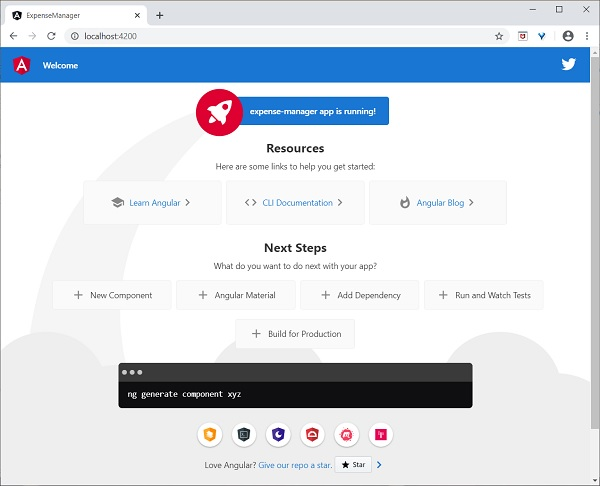
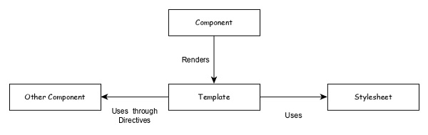
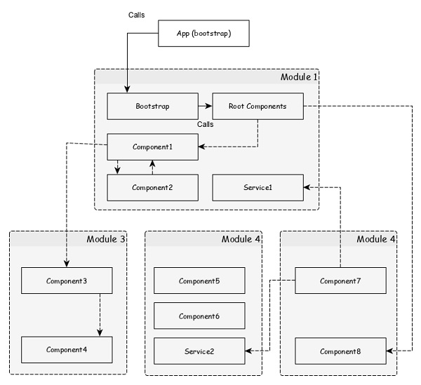
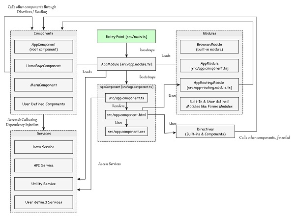
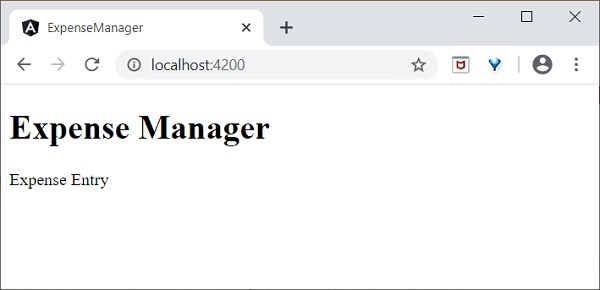
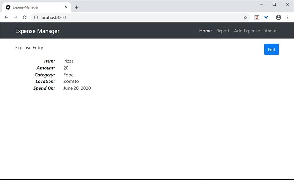

# Bulilding WebApps with Angular
## Note
If you're getting errors when running `npm install`, you can often solve them by running `npm install --legacy-peer-deps` instead of npm install .

## Introduction to Angular
Angular 8 is a TypeScript based full-stack web framework for building web and mobile applications. One of the major advantage is that the Angular 8 support for web application that can fit in any screen resolution. Angular application is fully compatible for mobiles, tablets, laptops or desktops. Angular 8 has an excellent user interface library for web developers which contains reusable UI components.

This functionality helps us to create Single Page Applications (SPA). SPA is reactive and fast application. For example, if you have a button in single page and click on the button then the action performs dynamically in the current page without loading the new page from the server. Angular 8 is Typescript based object oriented programming and support features for server side programming as well.

### Comparison of angular versions
As we know already, Google releases the version of Angular for the improvement of mobile and web development capabilities. All the released versions are backward compatible and can be updated easily to the newer version. Let’s go through the comparison of released versions.

#### AngularJS
AngularJs is very powerful JavaScript framework. It was released in October 2010. AngularJS based on Model View Controller (MVC) architecture and automatically handles JavaScript code suitable for each browser.

#### Angular 2.0
Angular 2.0 was released in September 2016. It is re-engineered and rewritten version of AngularJS. AngularJs had a focus on controllers but, version 2 has changed focus on components. Components are the main building block of application. It supports features for speed in rendering, updating pages and building cross-platform native mobile apps for Google Android and iOS.

#### Angular 4.0
Angular 4.0 was released in March 2017. It is updated to TypeScript 2.2, supports ng if-else conditions whereas Angular 2 supported only if conditions. Angular 4.0 introduces animation packages, Http search parameters and finally angular 4 applications are smaller and faster.

#### Angular 5.0
Angular 5.0 was released in November 2017. It supported some of the salient features such as HTTPClient API, Lambda support, Improved Compiler and build optimizer.

#### Angular 6.0
Angular 6.0 was released in May 2018. Features added to this version are updated Angular CLI, updated CDK, updated Angular Material, multiple validators and usage of reactive JS library.

#### Angular 7.0
Angular 7.0 was released in October 2018. Some of salient features are Google supported community, POJO based development, modular structure, declarative user interface and modular structure.

#### Angular 8 New features
Angular 8 comes up with the following new attractive features −

- Bazel support − If your application uses several modules and libraries, Bazel concurrent builds helps to load faster in your application.
- 
- Lazy loading − Angular 8 splits AppRoutingModule into smaller bundles and loads the data in the DOM.
- 
- Differential loading − When you create an application, Angular CLI generates modules and this will be loaded automatically then browser will render the data.
- 
- Web worker − It is running in the background, without affecting the performance of a page.
- 
- Improvement of CLI workflow − Angular 8 CLI commands ng-build, ng-test and ng-run are extended to third party libraries.
- 
- Router Backward Compatibility − Angular router backward compatibility feature helps to create path for larger projects so user can easily add their coding with the help of lazy coding.
- 
- Opt-in usage sharing − User can opt into share Angular CLI usage data.

#### Applications
Some of the popular website using Angular Framework are listed below −

- Weather.com − It is one of the leading forecasting weather report website.
- 
- Youtube − It is a video and sharing website hosted by Google.
- 
- Netflix − It is a technology and media services provider.
- 
- PayPal − It is an online payment system.


## Installation
### Prerequisite
As we know already, Angular is written in TypeScript. We need Node and npm to compile the files into JavaScript after that, we can deploy our application. For this purpose, Node.js must be installed in your system. Hopefully, you have installed Node.js on your machine.

We can check it using the below command −

```
node --version
```

You could see the version of node. It is show below −

```
v14.2.0
```
If Node is not installed, you can download and install by visiting the following link −

- https://nodejs.org/en/download/.

### Angular 8 installation
Angular 8 CLI installation is based on very simple steps. It will take not more than five minutes to install.

npm is used to install Angular 8 CLI. Once Node.js is installed, npm is also installed. If you want verify it, type the below command
```
npm -v
```
You could see the version below −
```
6.14.4
```
Let’s install Angular 8 CLI using npmas follows −
```
npm install -g @angular/cli@^8.0.0
```

To verify Angular 8 is properly installed on your machine, type the below command −

```
ng version
```
You could see the following response −

```
Angular CLI: 8.3.26 
Node: 14.2.0 
OS: win32 x64 
Angular: ... 
Package                    Version 
------------------------------------------------------
@angular-devkit/architect  0.803.26 
@angular-devkit/core       8.3.26 
@angular-devkit/schematics 8.3.26 
@schematics/angular        8.3.26 
@schematics/update         0.803.26 
rxjs                       6.4.0

```

## First Application
Let us create a simple angular application and analyse the structure of the basic angular application.

Let us check whether the Angular Framework is installed in our system and the version of the installed Angular version using below command −


```
ng --version
```
Here, ng is the CLI application used to create, manage and run Angular Application. It written in JavaScript and runs in NodeJS environment.

The result will show the details of the Angular version as specified below −
```
Angular CLI: 8.3.26 
Node: 14.2.0 
OS: win32 x64 
Angular: ... 
Package                    Version 
------------------------------------------------------
@angular-devkit/architect  0.803.26 
@angular-devkit/core       8.3.26 
@angular-devkit/schematics 8.3.26 
@schematics/angular        8.3.26 
@schematics/update         0.803.26 
rxjs                       6.4.0
```

So, Angular is installed in our system and the version is 8.3.26.

Let us create an Angular application to check our day to day expenses. Let us give ExpenseManageras our choice for our new application. Use below command to create the new application.


```
cd /path/to/workspace 
ng new expense-manager
```

Here, new is one of the command of the ng CLI application. It will be used to create new application. It will ask some basic question in order to create new application. It is enough to let the application choose the default choices. Regarding routing question as mentioned below, specify No. We will see how to create routing later in the Routing chapter.

```
Would you like to add Angular routing? No
```

Once the basic questions are answered, the ng CLI application create a new Angular application under expense-manager folder.

Let us move into the our newly created application folder.
```
cd expense-manager
```

Let us check the partial structure of the application. The structure of the application is as follows −

| favicon.ico 
| index.html 
| main.ts 
| polyfills.ts 
| styles.css 
| 
+---app 
|  app.component.css 
|  app.component.html 
|  app.component.spec.ts 
|  app.component.ts 
|  app.module.ts 
| 
+---assets 
|  .gitkeep 
| 
+---environments 
   environment.prod.ts 
   environment.ts

Here, We have shown, only the most important file and folder of the application.

- favicon.ico and assets are application’s icon and application’s root asset folder.

- polyfills.ts contains standard code useful for browser compatibility.

- environments folder will have the application’s setting. It includes production and development setup.

- main.ts file contains the startup code.

- index.html is the application base HTML code.

- styles.css is the base CSS code.

- app folder contains the Angular application code, which will be learn elaborately in the upcoming chapters.

Let us start the application using below command −
```
ng serve
```

Output will look like:
```
10% building 3/3 modules 0 activei wds: Project is running at http://localhost:4200/webpack-dev-server/
i wds: webpack output is served from /

i wds: 404s will fallback to //index.html 
chunk {main} main.js, main.js.map (main) 49.2 kB [initial] [rendered] 
chunk {polyfills} polyfills.js, polyfills.js.map (polyfills) 269 kB [initial] [rendered] 
chunk {runtime} runtime.js, runtime.js.map (runtime) 6.15 kB [entry] [rendered] 
chunk {styles} styles.js, styles.js.map (styles) 9.75 kB [initial] [rendered] 
chunk {vendor} vendor.js, vendor.js.map (vendor) 3.81 MB [initial] [rendered] 
Date: 2020-05-26T05:02:14.134Z - Hash: 0dec2ff62a4247d58fe2 - Time: 12330ms 
** Angular Live Development Server is listening on localhost:4200, open your 
browser on http://localhost:4200/ ** 
i wdm: Compiled successfully.
```
Here, serve is the sub command used to compile and run the Angular application using a local development web server. ng server will start a development web server and serves the application under port, 4200.

Let us fire up a browser and opens http://localhost:4200. The browser will show the application as shown below −



Let us change the title of the application to better reflect our application. Open src/app/app.component.ts and change the code as specified below −

```
export class AppComponent { 
   title = 'Expense Manager'; 
}
```

Our final application will be rendered in the browser as shown below −

.jpg)

We will change the application and learn how to code an Angular application in the upcoming chapters.

## Architecture
Let us see the architecture of the Angular framework in this chapter.

Angular framework is based on four core concepts and they are as follows −

- Components.
- Templates with Data binding and Directives.
- Modules.
- Services and dependency injection.

### Component
The core of the Angular framework architecture is Angular Component. Angular Component is the building block of every Angular application. Every angular application is made up of one more Angular Component. It is basically a plain JavaScript / Typescript class along with a HTML template and an associated name.

The HTML template can access the data from its corresponding JavaScript / Typescript class. Component’s HTML template may include other component using its selector’s value (name). The Angular Component may have an optional CSS Styles associated it and the HTML template may access the CSS Styles as well.



Let us analyse the AppComponent component in our ExpenseManager application. The AppComponent code is as follows −

```
// src/app/app.component.ts 
import { Component } from '@angular/core'; 
@Component({ 
   selector: 'app-root', 
   templateUrl: './app.component.html', 
   styleUrls: ['./app.component.css'] 
}) 
export class AppComponent { 
   title = 'Expense Manager'; 
}
```
`@Component` is a decorator and it is used to convert a normal Typescript class to Angular Component.

`app-root` is the selector / name of the component and it is specified using selector meta data of the component’s decorator. `app-root` can be used by application root document, src/index.html as specified below

```
<!doctype html> 
<html lang="en"> 
   <head> 
      <meta charset="utf-8"> 
      <title>ExpenseManager</title> 
      <base href="/"> 
      <meta name="viewport" content="width=device-width, initial-scale=1"> 
      <link rel="icon" type="image/x-icon" href="favicon.ico"> 
   </head> 
   <body> 
      <app-root></app-root> 
   </body> 
</html>
```

`app.component.html` is the HTML template document associated with the component. The component template is specified using templateUrl meta data of the @Component decorator.

`app.component.css` is the CSS style document associated with the component. The component style is specified using styleUrls meta data of the @Component decorator.

AppComponent property (title) can be used in the HTML template as mentioned below −

```
{{ title }}
```

### Template
Template is basically a super set of HTML. Template includes all the features of HTML and provides additional functionality to bind the component data into the HTML and to dynamically generate HTML DOM elements.

The core concept of the template can be categorised into two items and they are as follows −

#### Data binding
Used to bind the data from the component to the template.

```
{{ title }}
```

Here, title is a property in AppComponent and it is bind to template using Interpolation.

### Directives
Used to include logic as well as enable creation of complex HTML DOM elements.
```
<p *ngIf="canShow">
   This sectiom will be shown only when the *canShow* propery's value in the corresponding component is *true* </p> 
<p [showToolTip]='tips' />
```

Here, ngIf and showToolTip (just an example) are directives. ngIf create the paragraph DOM element only when canShow is true. Similarly, showToolTip is Attribute Directives, which adds the tooltip functionality to the paragraph element.

When user mouse over the paragraph, a tooltip with be shown. The content of the tooltip comes from tips property of its corresponding component.

### Modules
Angular Module is basically a collection of related features / functionality. Angular Module groups multiple components and services under a single context.

For example, animations related functionality can be grouped into single module and Angular already provides a module for the animation related functionality, BrowserAnimationModule module.

An Angular application can have any number of modules but only one module can be set as root module, which will bootstrap the application and then call other modules as and when necessary. A module can be configured to access functionality from other module as well. In short, components from any modules can access component and services from any other modules.

Following diagram depicts the interaction between modules and its components.



Let us check the root module of our Expense Manager application.

```
import { BrowserModule } from '@angular/platform-browser'; 
import { NgModule } from '@angular/core'; 
import { AppComponent } from './app.component'; 
@NgModule({ 
   declarations: [ 
      AppComponent 
   ], 
   imports: [ 
      BrowserModule 
   ], 
   providers: [], 
   bootstrap: [AppComponent] 
}) 
export class AppModule { }
```
Here,

- NgModule decorator is used to convert a plain Typescript / JavaScript class into Angular module.
- 
- declarations option is used to include components into the AppModulemodule.
- 
- bootstrap option is used to set the root component of the AppModulemodule.
- 
- providers option is used to include the services for the AppModulemodule.
- 
- imports option is used to import other modules into the AppModulemodule.


### Services
Services are plain Typescript / JavaScript class providing a very specific functionality. Services will do a single task and do it best. The main purpose of the service is reusability. Instead of writing a functionality inside a component, separating it into a service will make it useable in other component as well.

Also, Services enables the developer to organise the business logic of the application. Basically, component uses services to do its own job. Dependency Injection is used to properly initialise the service in the component so that the component can access the services as and when necessary without any setup.

###Workflow of Angular application
We have learned the core concepts of Angular application. Let us see the complete flow of a typical Angular application.



`src/main.ts` is the entry point of Angular application.

`src/main.ts` bootstraps the AppModule (src/app.module.ts), which is the root module for every Angular application.

```
platformBrowserDynamic().bootstrapModule(AppModule) .catch(err => console.error(err));
```
AppModule bootstraps the AppComponent (src/app.component.ts), which is the root component of every Angular application.
```
@NgModule({ 
   declarations: [ 
      AppComponent 
   ], 
      imports: [ 
   BrowserModule 
   ], 
   providers: [], 
   bootstrap: [AppComponent] 
}) 
export class AppModule { }
```

Here,

`AppModule` loads modules through imports option.

`AppModule` also loads all the registered service using Dependency Injection (DI) framework.

`AppComponent` renders its template (`src/app.component.html`) and uses the corresponding styles (`src/app.component.css`). `AppComponent` name, app-root is used to place it inside the src/index.html.

```
<!doctype html> 
<html lang="en"> 
   <head> 
      <meta charset="utf-8"> 
      <title>ExpenseManager</title> 
      <base href="/"> 
      <meta name="viewport" content="width=device-width, initial-scale=1"> 
      <link rel="icon" type="image/x-icon" href="favicon.ico"> 
   </head> 
   <body> 
      <app-root></app-root> 
   </body> 
</html>
```

AppComponent can use any other components registered in the application.
```
@NgModule({ 
   declarations: [ 
      AppComponent 
      AnyOtherComponent
   ], 
   imports: [ 
      BrowserModule 
   ], 
   providers: [], 
   bootstrap: [AppComponent] 
}) 
export class AppModule { }
```

Component use other component through directive in its template using target component’s selector name.

```
<component-selector-name></component-selector-name>
```

Also, all registered services are accessible to all Angular components through Dependency Injection (DI) framework.

## Components and Templates
As we learned earlier, Components are building block of Angular application. The main job of Angular Component is to generate a section of web page called view. Every component will have an associated template and it will be used to generate views.

Let us learn the basic concept of component and template in this chapter.

### Add a component
Let us create a new component in our ExpenseManager application.

Open command prompt and go to ExpenseManager application.
```
cd /go/to/expense-manager
```

Create a new component using ng generate component command as specified below −

```
ng generate component expense-entry
```
Output
The output is mentioned below −

```
CREATE src/app/expense-entry/expense-entry.component.html (28 bytes) 
CREATE src/app/expense-entry/expense-entry.component.spec.ts (671 bytes) 
CREATE src/app/expense-entry/expense-entry.component.ts (296 bytes) 
CREATE src/app/expense-entry/expense-entry.component.css (0 bytes) 
UPDATE src/app/app.module.ts (431 bytes)
```

Here,

- ExpenseEntryComponent is created under src/app/expense-entry folder.
- Component class, Template and stylesheet are created.
- AppModule is updated with new component.

Add title property to ExpenseEntryComponent (src/app/expense-entry/expense-entry.component.ts) component.

```
import { Component, OnInit } from '@angular/core'; @Component({ 
   selector: 'app-expense-entry', 
   templateUrl: './expense-entry.component.html', styleUrls: ['./expense-entry.component.css'] 
}) 
export class ExpenseEntryComponent implements OnInit {
   title: string;
   constructor() { } 
   ngOnInit() { 
      this.title = "Expense Entry" 
   } 
}
```

Update template, src/app/expense-entry/expense-entry.component.htmlwith below content.
```
<p>{{ title }}</p>
```

Open src/app/app.component.html and include newly created component.

```
<h1>{{ title }}</h1>
<app-expense-entry></app-expense-entry>
```

Here,

- app-expense-entry is the selector value and it can be used as regular HTML Tag.

Finally, the output of the application is as shown below −



We will update the content of the component during the course of learning more about templates.

### Templates
The integral part of Angular component is Template. It is used to generate the HTML content. Templates are plain HTML with additional functionality.

#### Attach a template
Template can be attached to Angular component using @component decorator’s meta data. Angular provides two meta data to attach template to components.

##### templateUrl

We already know how to use templateUrl. It expects the relative path of the template file. For example, AppComponent set its template as app.component.html.
```
templateUrl: './app.component.html',
```

##### template

`template` enables to place the HTML string inside the component itself. If the template content is minimal, then it will be easy to have it Component class itself for easy tracking and maintenance purpose.

```
@Component({ 
   selector: 'app-root', 
   templateUrl: `<h1>{{ title }}</h1>`, 
   styleUrls: ['./app.component.css'] 
}) 
export class AppComponent implements OnInit { 
   title = 'Expense Manager'; 
   constructor(private debugService : DebugService) {} ngOnInit() { 
      this.debugService.info("Angular Application starts"); 
   } 
}
```

#### Attach Stylesheet
Angular Templates can use CSS styles similar to HTML. Template gets its style information from two sources, a) from its component b) from application configuration.

##### Component configuration

Component decorator provides two option, styles and styleUrls to provide CSS style information to its template.

- Styles − styles option is used to place the CSS inside the component itself.

```
styles: ['h1 { color: '#ff0000'; }']
```

- styleUrls − styleUrls is used to refer external CSS stylesheet. We can use multiple stylesheet as well.
```
styleUrls: ['./app.component.css', './custom_style.css']
```
#### Application configuration
Angular provides an option in project configuration (angular.json) to specify the CSS stylesheets. The styles specified in angular.json will be applicable for all templates. Let us check our angular.json as shown below −
```
{
"projects": { 
   "expense-manager": { 
      "architect": { 
         "build": { 
            "builder": "@angular-devkit/build-angular:browser", "options": { 
               "outputPath": "dist/expense-manager", 
               "index": "src/index.html", 
               "main": "src/main.ts", 
               "polyfills": "src/polyfills.ts", 
               "tsConfig": "tsconfig.app.json", 
               "aot": false, 
               "assets": [ 
                  "src/favicon.ico", 
                  "src/assets" 
               ], 
               "styles": [ 
                  "src/styles.css" 
               ], 
               "scripts": [] 
            }, 
         }, 
      } 
   }}, 
   "defaultProject": "expense-manager" 
}
```
Here,

- styles option setssrc/styles.css as global CSS stylesheet. We can include any number of CSS stylesheets as it supports multiple values.

### Include bootstrap
Let us include bootstrap into our ExpenseManager application using styles option and change the default template to use bootstrap components.

Open command prompt and go to ExpenseManager application.

```
cd /go/to/expense-manager
```

Install bootstrap and JQuery library using below commands

```
npm install --save bootstrap@4.5.0 jquery@3.5.1
```

Here, We have installed JQuery, because, bootstrap uses jquery extensively for advanced components.

add angular.json and set bootstrap and jquery library path.

```
{ 
   "projects": { 
      "expense-manager": { 
         "architect": { 
            "build": {
               "builder":"@angular-devkit/build-angular:browser", "options": { 
                  "outputPath": "dist/expense-manager", 
                  "index": "src/index.html", 
                  "main": "src/main.ts", 
                  "polyfills": "src/polyfills.ts", 
                  "tsConfig": "tsconfig.app.json", 
                  "aot": false, 
                  "assets": [ 
                     "src/favicon.ico", 
                     "src/assets" 
                  ], 
                  "styles": [ 
                     "./node_modules/bootstrap/dist/css/bootstrap.css", "src/styles.css" 
                  ], 
                  "scripts": [ 
                     "./node_modules/jquery/dist/jquery.js", "./node_modules/bootstrap/dist/js/bootstrap.js" 
                  ] 
               }, 
            }, 
         } 
   }}, 
   "defaultProject": "expense-manager" 
}
```
Here, scripts option is used to include JavaScript library. JavaScript registered through scripts will be available to all Angular components in the application.

Open app.component.html and change the content as specified below
```
<!-- Navigation --> 
<nav class="navbar navbar-expand-lg navbar-dark bg-dark static-top"> 
   <div class="container"> 
      <a class="navbar-brand" href="#">{{ title }}</a> <button class="navbar-toggler" type="button" data-toggle="collapse" data-target="#navbarResponsive" aria-controls="navbarResponsive" aria-expanded="false" aria-label="Toggle navigation"> 
         <span class="navbar-toggler-icon">
         </span> 
      </button> 
      <div class="collapse navbar-collapse" id="navbarResponsive"> 
         <ul class="navbar-nav ml-auto"> 
            <li class="nav-item active"> 
            <a class="nav-link" href="#">Home
               <span class="sr-only">(current)
               </span>
            </a> 
            </li> 
            <li class="nav-item"> 
            <a class="nav-link" href="#">Report</a> 
            </li> 
            <li class="nav-item"> 
            <a class="nav-link" href="#">Add Expense</a> 
            </li> 
            <li class="nav-item"> 
            <a class="nav-link" href="#">About</a> 
            </li> 
         </ul> 
      </div> 
   </div> 
</nav> 
<app-expense-entry></app-expense-entry>
```

Here, Used bootstrap navigation and containers.

Open src/app/expense-entry/expense-entry.component.html and place below content.
```
<!-- Page Content --> 
<div class="container"> 
   <div class="row"> 
      <div class="col-lg-12 text-center" style="padding-top: 20px;"> 
         <div class="container" style="padding-left: 0px; padding-right: 0px;"> 
            <div class="row"> 
            <div class="col-sm" style="text-align: left;"> {{ title }} 
            </div> 
            <div class="col-sm" style="text-align: right;"> 
               <button type="button" class="btn btn-primary">Edit</button> 
            </div> 
            </div> 
         </div> 
         <div class="container box" style="margin-top: 10px;"> 
         <div class="row"> 
         <div class="col-2" style="text-align: right;">  
            <strong><em>Item:</em></strong> 
         </div> 
         <div class="col" style="text-align: left;"> 
            Pizza 
         </div>
         </div> 
         <div class="row"> 
         <div class="col-2" style="text-align: right;">
            <strong><em>Amount:</em></strong> 
         </div> 
         <div class="col" style="text-align: left;"> 
            20 
         </div> 
         </div> 
         <div class="row"> 
         <div class="col-2" style="text-align: right;"> 
            <strong><em>Category:</em></strong> 
         </div> 
         <div class="col" style="text-align: left;"> 
            Food 
         </div> 
         </div> 
         <div class="row"> 
         <div class="col-2" style="text-align: right;"> 
            <strong><em>Location:</em></strong>
         </div> 
         <div class="col" style="text-align: left;"> 
            Zomato 
         </div> 
         </div> 
         <div class="row"> 
         <div class="col-2" style="text-align: right;"> 
            <strong><em>Spend On:</em></strong> 
         </div> 
         <div class="col" style="text-align: left;"> 
            June 20, 2020 
         </div> 
         </div> 
      </div> 
   </div> 
</div> 
</div>
```

Restart the application.

The output of the application is as follows −



